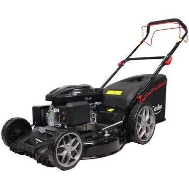

# Tondeuse Mulching

## Prix

Son prix de base est de 399,00 eur.  
Avec la promotion, la tondeuse vaut **299,00 eur**.

## Description

Tondeuse thermique autotractée, idéale pour les jardins d’une superficie allant jusqu’à 2200m². Puissante et robuste, sa cylindrée de 196 cm³ vous assure une coupe parfaite à chaque tonte.  
Equipée d’un carter de coupe renforcé de 56 cm et d’un bac de ramassage d’une capacité de 75L, cette tondeuse est destinée aux grandes étendues, vous permettant ainsi de limiter le nombre de passages. A l’aide de la fonction mulching, votre herbe sera broyée finement par la lame pour ainsi retomber sur le sol et le fertiliser.  
Enfin, pour un confort d’utilisation optimal, la T56T - 196LAML dispose de grosses roues au diamètre plus important à l'arrière (28 cm) qu'à l'avant (20 cm) afin de respecter votre pelouse et tondre sans effort.

Carter acier résistant et facile d'entretien à l'aide du raccord Quickclean pour tuyau d'arrosage.

### Caractéristiques techniques

* Tondeuse tractée moteur Loncin 196cc OHV (3,2kW)
* Carter acier robuste largeur de coupe 56 cm
* Réglage hauteur de coupe centralisé 7 positions : 25-75mm
* Réservoir essence : 1L
* Réservoir huile : 0,55L
* Diamètre roues : 20cm à l'avant / 28cm à l'arrière
* Roulements à billes
* Tondeuse 4 en 1 : ramassage, éjection latérale/arrière et mulching
* Bac semi-rigide de 75L
* Guidon pliable

### Informations techniques

#### Garantie
Garantie 2 ans

#### Dimensions et poids des colis
Dimensions (LxlxH) : 92cm x 60cm x 44cm
Poids : 36,0kg

#### Caractéristiques
Moteur Loncin OHV (3,2kW)  
Puissance 196 cm³  
Pour surfaces jusqu'à 2200 m²  
Carter Acier renforcé  
Largeur de coupe 56 cm  
Bac de ramassage Semi-rigide de 75L  
Réglage hauteur de coupe Hauteur de coupe centralisé 7 positions : 25-75mm  
Mulching Inclus
